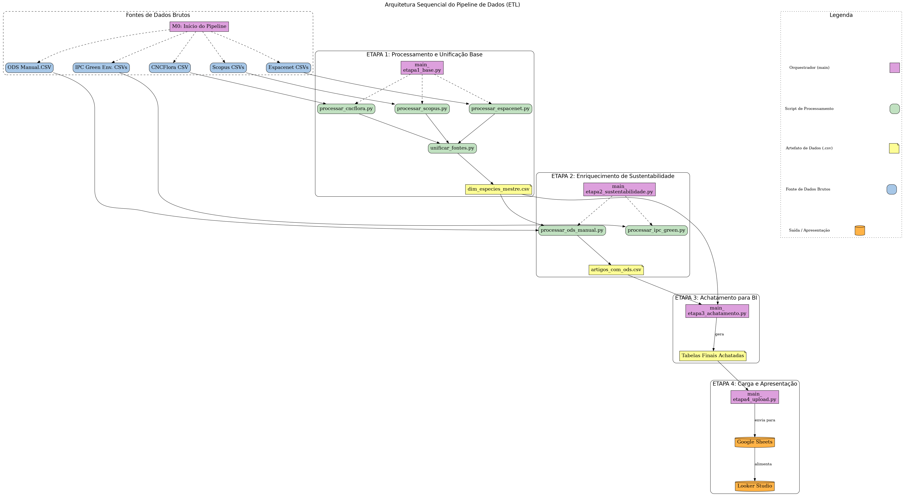

# Observatório de CT&I sobre Plantas Endêmicas da Amazônia


Este repositório contém o código-fonte e a metodologia para o pipeline de dados desenvolvido como parte da dissertação **Indicadores bibliométricos e sustentabilidade: painel para monitoramento de  desenvolvimentos científicos e tecnológicos sobre plantas endêmicas da Amazônia**. O objetivo deste projeto é automatizar a coleta, limpeza, modelagem e integração de dados de múltiplas fontes para a criação de um painel de indicadores de Ciência, Tecnologia e Inovação (CT&I) sobre a flora endêmica da Amazônia.

---

## 🏛️ Arquitetura do Pipeline

O projeto implementa um pipeline de Extração, Transformação e Carga (ETL) orquestrado em **quatro etapas principais**. Cada etapa é gerenciada por um script específico, garantindo modularidade e clareza no fluxo de dados, que processa dados brutos e os estrutura em um modelo otimizado para análise.

* **Etapa 1 (Processamento Base):** Realiza a extração e limpeza inicial dos dados brutos das fontes principais (`Scopus`, `CNCFlora`, `Espacenet`) e cria uma dimensão mestre de espécies.
* **Etapa 2 (Enriquecimento):** Adiciona camadas de informação de sustentabilidade, processando dados de ODS (Objetivos de Desenvolvimento Sustentável) e patentes "verdes".
* **Etapa 3 (Achatamento):** Consolida e transforma os dados processados e enriquecidos em tabelas finais (modelo estrela), otimizadas para performance em ferramentas de BI.
* **Etapa 4 (Carga):** Realiza o upload das tabelas finais para a camada de apresentação (Google Sheets), que serve como fonte de dados para o painel no Looker Studio.

## 🗺️ Arquitetura Visual (Fluxograma)

O fluxograma abaixo foi gerado automaticamente pelo script `scripts/desenhar_pipeline.py` e detalha o fluxo de dados completo, desde as fontes brutas até a camada de apresentação.



## 🛠️ Tecnologias Utilizadas

* **Linguagem:** Python 3.10+
* **Bibliotecas Principais:** Pandas
* **Visualização da Arquitetura:** Graphviz
* **Ambiente:** Visual Studio Code (Codespaces)
* **Controle de Versão:** Git & GitHub

## 🚀 Guia de Instalação e Execução

Siga os passos abaixo para replicar o ambiente e executar o pipeline de dados.

### 1. Configuração do Ambiente

1.  **Clonar o Repositório:**
    ```bash
    git clone <URL_DO_SEU_REPOSITORIO_GITHUB>
    cd <NOME_DA_PASTA_DO_PROJETO>
    ```

2.  **Criar e Ativar o Ambiente Virtual:**
    ```bash
    # Criar o ambiente
    python3 -m venv .venv
    
    # Ativar no macOS/Linux
    source .venv/bin/activate
    
    # Ativar no Windows (PowerShell)
    # .\.venv\Scripts\Activate.ps1
    ```

3.  **Instalar as Dependências:**
    Certifique-se de que o arquivo `requirements.txt` exista na raiz do projeto com o conteúdo abaixo.

    *Conteúdo do `requirements.txt`:*
    ```
    pandas
    graphviz
    ```

    *Comando de Instalação:*
    ```bash
    pip install -r requirements.txt
    ```
    *Obs: A biblioteca `graphviz` do Python requer uma instalação no sistema operacional. Em ambientes baseados em Debian/Ubuntu (como o GitHub Codespaces), execute: `sudo apt-get update && sudo apt-get install -y graphviz`*

### 2. Organização dos Dados Brutos

Antes da execução, os arquivos de dados brutos devem ser posicionados na seguinte estrutura dentro de `data/raw/`:

    data/raw/
    ├── cncflora/
    │   └── lista_vermelha_cnc_flora.csv
    ├── espacenet_input/
    │   └── espacenet_angiosperma.csv
    └── scopus_input/
    └── scopus_angiospermas.csv

### 3. Execução do Pipeline

O pipeline foi projetado para ser executado em etapas sequenciais. Execute os scripts orquestradores na ordem correta a partir da **pasta raiz** do projeto:

```bash
# Etapa 1: Processa e unifica as fontes base
python scripts/main\(EXECUTE\)/main_etapa1_base.py

# Etapa 2: Enriquece os dados com informações de sustentabilidade
python scripts/main\(EXECUTE\)/main_etapa2_sustentabilidade.py

# Etapa 3: Consolida e achata as tabelas para o modelo final
python scripts/main\(EXECUTE\)/main_etapa3_achatamento.py

# Etapa 4: Faz o upload dos dados para a camada de apresentação
python scripts/main\(EXECUTE\)/main_etapa4_upload.py
```

---
## ⚙️ Descrição dos Componentes

    * **scripts/main(EXECUTE)/:** Contém os scripts orquestradores de cada uma das 4 etapas principais do pipeline.
    * **scripts/:** Contém os scripts específicos com a lógica de negócio para processar cada fonte de dados. São chamados pelos orquestradores.
    * **scripts/desenhar_pipeline.py:** Script utilitário para gerar o diagrama da arquitetura do projeto.


## 🛣️ Roadmap de Trabalhos Futuros

    * Inclusão de novas fontes de dados (a serem definidas) e integração com o modelo de dados atual;
    * Avaliação geral do processo de automação.

